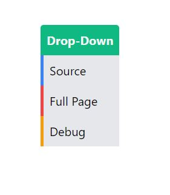

# Drop-Down Component using Tailwind css
This is a Gallery component created using Tailwind css. A simple example of the usage of Group-hover. Group hover is defaultly disabled in tailwind, it has to be enabled mannualy in the js config file.

[**click here to view the component**](https://harishkumaaran.github.io/Dropdowntailwind/)
&nbsp;

# screenshots 

&nbsp;

# Technology Stack
- HTML
- CSS
- Tailwind CSS

&nbsp;

# Credits
- This Dropdown component is done as a part of my Front end curriculum at Aekam Labs, Coimbatore.

